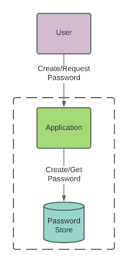
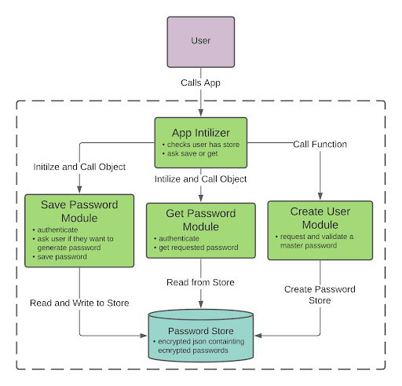
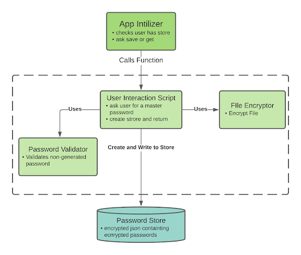
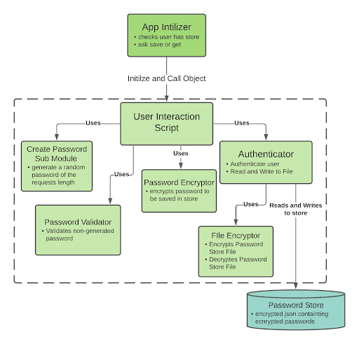
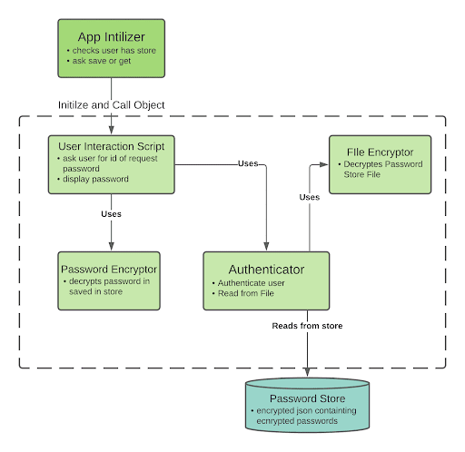

# pyWordManager
a simple password manager written in python.

pyWordManager is a locally run password manager via the terminal. Design decisions were made utilising [OWASP](https://owasp.org/) recommended implementations.

